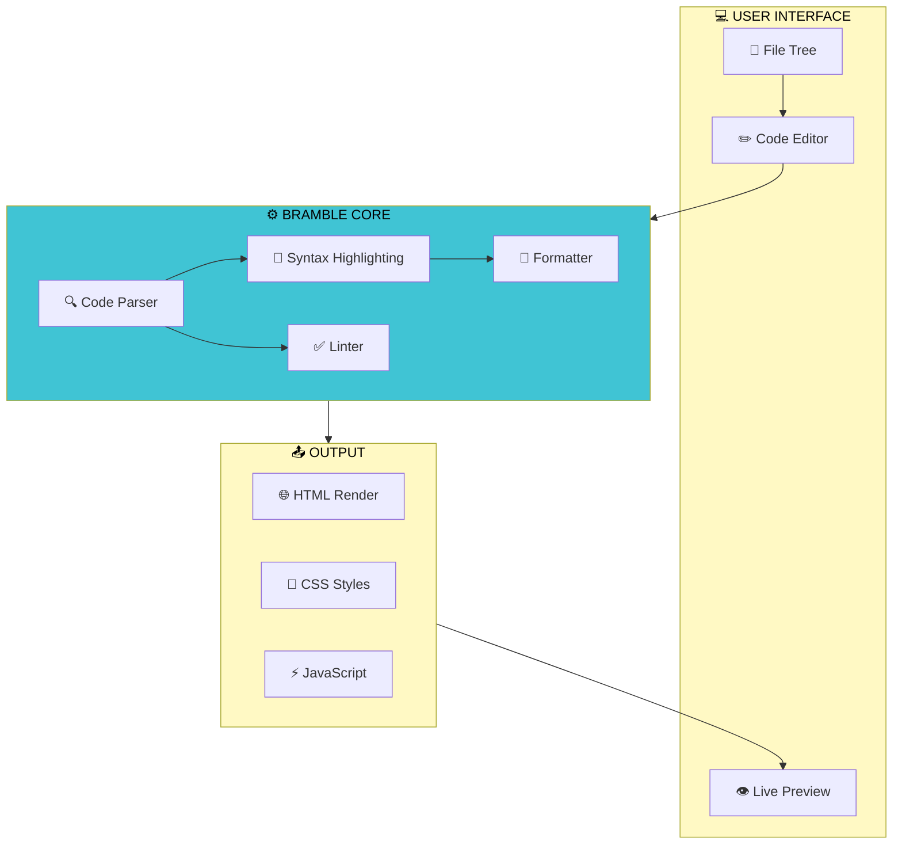

# bramble-editor

A lightweight, browser-based code editor with live preview capabilities. Bramble Core provides syntax highlighting, linting, and formatting while outputting clean HTML, CSS, and JavaScript.

## 🗺️ System Architecture

